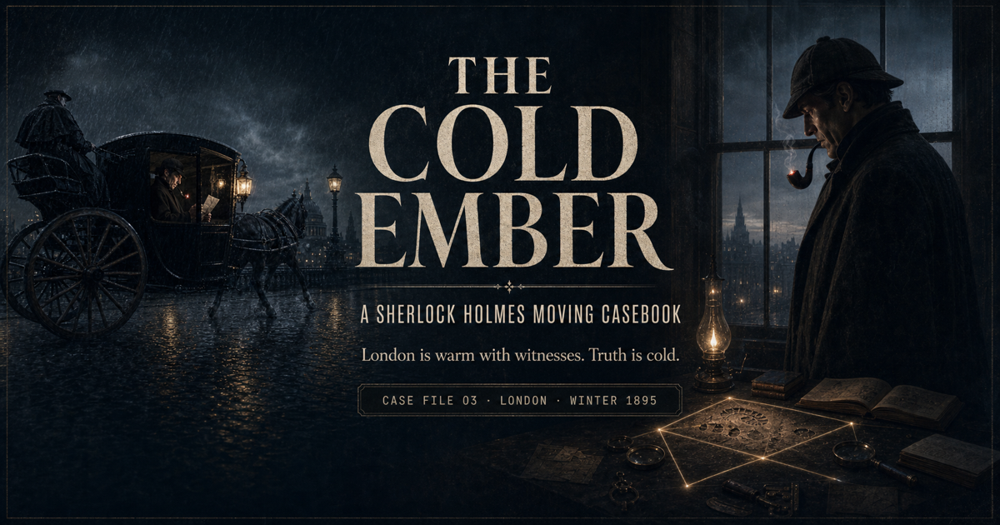

# The Cold Ember

[](https://github.com/shanto12/sherlock-cold-ember/actions/workflows/ci.yml)
[](https://github.com/shanto12/sherlock-cold-ember/actions/runs/29455183310)
[](https://app.netlify.com/projects/sherlock-cold-ember/deploys)
[](https://github.com/shanto12/sherlock-cold-ember/releases/tag/v1.2.0)



**The Cold Ember** is an original, interactive Sherlock Holmes case set in London during the winter of 1895. It treats the browser like a moving casebook: visitors follow a telegram from Baker Street, ride through gaslit streets in a period-correct hansom, inspect a bindery crime scene, cross-reference evidence, and test a conclusion.

[View the production experience](https://sherlock-cold-ember.netlify.app) · [Open the immutable v1.2.0 release](https://github.com/shanto12/sherlock-cold-ember/releases/tag/v1.2.0) · [Read the master plan](./docs/master-plan.md) · [Review final release evidence](./docs/release-evidence.md) · [Audit dialogue provenance](./docs/dialogue-sources.md) · [Inspect cinematic audio QA](./scripts/audio/PROVENANCE.md) · [Trace visual assets](./docs/visual-assets.md) · [Read the asset notice](./ASSET-NOTICE.md)

## What makes it distinctive

- Five cinematic, full-page observations with original artwork and a cold-cobalt/gas-flame visual system
- Bounded CSS and Canvas motion for rain, smoke, gaslight, cab rhythm, drifting pages, and deduction lines
- Five default-on, scene-aware cinematic masters with rain, fire, hansom rhythms, horses, clocks, paper, room tone, Foley, and responsive clue cues
- Original Holmes, Watson, Lestrade, Gregory, Irene Adler, Mrs. Hudson, and hansom-driver performances produced offline with synchronized captions
- Short, source-linked canonical dialogue echoes inside an otherwise original case script, with strict 1895 chronology and no actor imitation
- Keyboard, touch, and pointer parity, plus a persistent motion pause and a composed reduced-motion edition
- An evidence notebook, chapter index, conclusion workflow, and Netlify-powered consultation inquiry
- Crawlable story content, field notes, metadata routes, social artwork, and hardened production headers
- Parallel Next.js/Netlify and Vinext/Sites release paths from the same public source

## Technology

- Next.js 16, React 19, and TypeScript
- Vinext and Cloudflare Workers for the private Sites parity build
- Netlify Next Runtime and Netlify Forms for public production
- Native CSS, Canvas, Web Audio, and self-hosted audio with browser speech synthesis retained only as a graceful fallback
- Offline ElevenLabs Voice Design, Eleven v3, Sound Effects v2, and FFmpeg mastering; no provider call or credential exists in the browser runtime
- GitHub Actions for linting, type checks, rendered tests, both production builds, and a production dependency audit

## Local development

Requirements: Node.js 22.13 or later and npm.

```bash
npm ci
npm run dev
```

The Sites-compatible preview is available at `http://localhost:3000`. To run the direct Next.js development server used for Netlify parity:

```bash
npm run dev:next
```

## Verification

Run the full local release gate:

```bash
npm run verify
```

The release gate covers linting, strict TypeScript checks, rendered behavior tests, the Vinext/Sites build, the Next.js/Netlify build, and the production-only npm audit. Playwright additionally proves that conversation is armed by default but remains browser-gesture locked, the first ordinary interaction starts the active scene, the off preference persists, all five masters and captions transition correctly at all three release widths, hidden tabs release scheduled work, and stopping sound clears every player, node, and timer. Final v1.2.0 proof—including real Chrome, responsive, form-delivery, console, network, route, CSP, header, CI, CodeQL, and exact deployment checks—is recorded in [`docs/release-evidence.md`](./docs/release-evidence.md).

## Release architecture

| Surface | Purpose | Configuration |
| --- | --- | --- |
| Netlify production | Public, canonical experience and form handling | [`netlify.toml`](./netlify.toml) |
| Sites parity | Exact-source private deployment | [`.openai/hosting.json`](./.openai/hosting.json) and [`worker/index.ts`](./worker/index.ts) |
| Shared hardening | CSP and browser security headers | [`lib/security-headers.ts`](./lib/security-headers.ts) |
| CI | Locked install and release-quality gates | [`.github/workflows/ci.yml`](./.github/workflows/ci.yml) |

No credentials or deployment tokens belong in this repository. Local `.env*`, Netlify state, Wrangler state, build output, and work files are ignored.

## Historical and rights note

The site uses original scene compositions and an original case script, punctuated by seven brief, visibly attributed excerpts from public-domain Doyle stories. It is an independent, unofficial adaptation and is not affiliated with any film, television production, museum, platform, publisher, or estate. No actor likeness, actor recording, audiobook, or modern screen-franchise design is used. Every produced voice is an original non-celebrity character performance; generated ambience and Foley are self-hosted, while bounded procedural sound remains as an enhancement and fallback.

Smoking appears only as non-promotional historical context. Tobacco use is harmful; the experience does not endorse it.

## License

Source code and non-audio original project materials are available under the
[MIT License](./LICENSE). Produced voice, ambience, and Foley recordings have
the extraction and standalone-reuse restrictions described in the
[Asset Notice](./ASSET-NOTICE.md). Public-domain quotations remain public
domain in the United States.

## Contributing and security

Focused contributions are welcome through the protected pull-request workflow;
see [`CONTRIBUTING.md`](./CONTRIBUTING.md) for the local and release gates.
Report suspected vulnerabilities only through the private process in
[`SECURITY.md`](./SECURITY.md). Weekly Dependabot maintenance covers npm and
GitHub Actions, while major dependency upgrades remain deliberate full-gate
changes.
